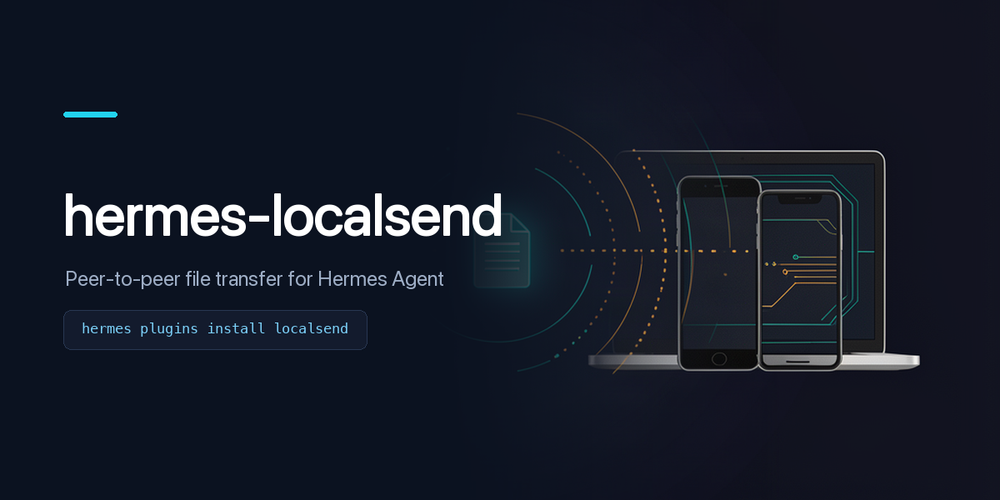
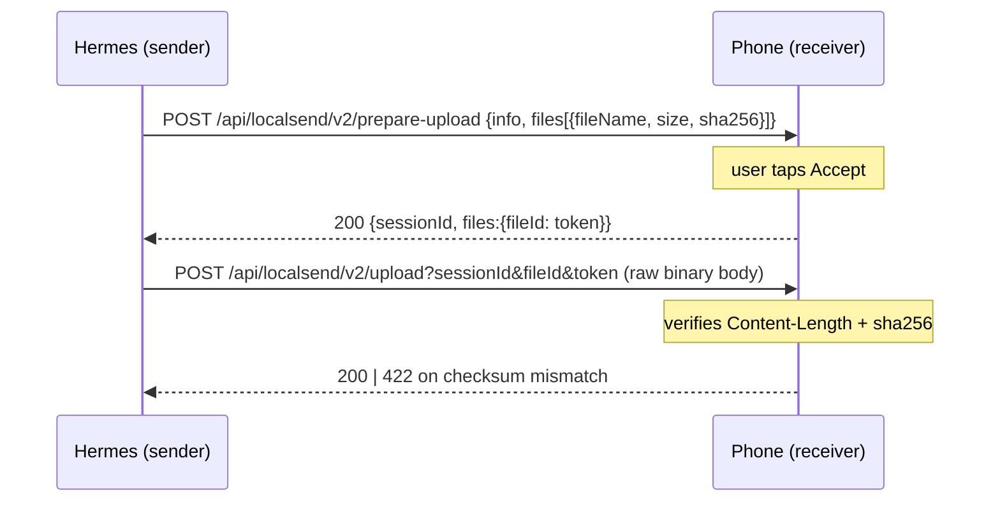

<div align="center">

**Move files between the machine your agent runs on and the phones, laptops and tablets on your LAN.**
No account, no cloud, and nothing to install on the other device — it just talks [LocalSend](https://localsend.org).

[](https://github.com/tylerbrevard/hermes-localsend/releases)
[](LICENSE)
[](tests/)
[](https://github.com/localsend/protocol)
[](#why-standard-library-only)
[](#limits)
[](https://github.com/NousResearch/hermes-agent)

```bash
hermes plugins install localsend && hermes plugins enable localsend
```

</div>

---

## Why this exists

LocalSend is the one transfer path that works everywhere without an account: iPhone ↔ Mac, Android ↔
Linux, a guest's laptop ↔ your homelab. It's also the one transfer path an agent **cannot** use —
there's no CLI, no API, no scripting surface.

This plugin gives Hermes both halves of the protocol, so "send me that file" and "catch the photo my
phone is pushing" become ordinary tool calls: schedulable, scriptable, and reachable from any Hermes
channel — including a chat message from the phone itself.

| | |
| --- | --- |
| **Discover** | `localsend_discover` — multicast announce, `/register` callbacks, plus the protocol's HTTP sweep for devices that ignore multicast |
| **Send** | `localsend_send` — `prepare-upload` → `upload`, every file carrying a `sha256` the receiver verifies |
| **Receive** | `localsend_receive` — a headless receiver that announces itself, so phones see this machine in their device list |

<a id="why-standard-library-only"></a>

**Why standard library only:** the plugin runs inside Hermes' own interpreter, and Hermes reinstalls
its venv from a lockfile on every update. Zero dependencies means this plugin can never be dropped
from that resolution, never pins a shared package against core, and installs offline.

## Install

```bash
# From the plugin catalog (name resolves to a reviewed, pinned commit)
hermes plugins install localsend
hermes plugins enable localsend

# Or straight from this repository
hermes plugins install tylerbrevard/hermes-localsend
hermes plugins enable localsend
```

Restart the gateway afterwards so the tools load into chat channels:

```bash
hermes gateway restart
```

Nothing else to configure — no dependencies, no keys, no service. Verify it landed:

```bash
hermes plugins doctor localsend     # → registrations: 3 tool(s), 0 hook(s)
```

## Use

```text
"Who's on the network?"                          → localsend_discover
"Send /tmp/report.pdf to Tyler's iPhone"         → localsend_send
"Push that photo back the other way"             → localsend_receive (start) → phone sends → (status)
"Send my phone a note that the build passed"     → localsend_send {"text": "build passed, 0 failures"}
```

### `localsend_discover`

```json
{"timeout_s": 3, "scan_subnets": true}
```

Returns each peer's `alias`, `ip`, `port`, `protocol`, `deviceType`, `deviceModel`, `fingerprint`
and `base_url`.

### `localsend_send`

<details>
<summary><b>Parameters</b></summary>

| Field | Type | Meaning |
| --- | --- | --- |
| `peer` | string | Target device — alias (`"Tyler's iPhone"`), IP, or `IP:port`. Case-insensitive; substring alias matches work. |
| `files` | string[] | Absolute paths to send. |
| `text` | string | Convenience: writes the text to a timestamped `.txt` in the outbox dir and sends it. |
| `discover` | boolean | Run discovery first and auto-select when exactly one peer is visible. |
| `pin` | string | PIN required by the receiver. Defaults to the configured `pin`. |

</details>

The receiver must accept the transfer — on a phone, that's someone tapping **Accept**. If nobody does,
the tool returns `403 rejected` rather than hanging.

### `localsend_receive`

```json
{"action": "start", "alias": "Hermes", "download_dir": "~/Downloads/LocalSend", "pin": ""}
{"action": "status"}
{"action": "stop"}
```

It serves `/register`, `/info`, `/prepare-upload`, `/upload` and `/cancel`, announces itself on the
multicast group so it shows up in every peer's device list, and saves incoming files into the inbox
after verifying the sender's `sha256`. `status` reports each file with its path, size, hash, sender
and timestamp. A second `photo.jpg` lands as `photo (1).jpg` — **an incoming file never overwrites an
existing one**.

## What it looks like

Real output from the installed plugin, not a mock-up:

```console
$ hermes -z "Call localsend_discover with timeout_s=2 and scan_subnets=false"
{
  "count": 0,
  "peers": [],
  "our_alias": "Hermes (Tylers-Mac-mini)",
  "port": 53317,
  "warnings": [],
  "hint": "Pass a peer's alias or ip to localsend_send. Devices must be on the same LAN or
           reachable subnet, and the LocalSend app must be open on the other device.",
  "success": true
}
```

```console
$ python3 ls-smoke.py     # 300 KB; the plugin's sender and receiver over real sockets
receiver: {"running": true, "alias": "Hermes Smoke", "port": 53317, "inbox": ".../inbox"}
send:     {"status": "sent", "bytes": 300000, "files": ["smoke.bin"]}
received: {"file": "smoke.bin", "bytes": 300000, "from": "Hermes (Tylers-Mac-mini)"}
sha source : 9d54d10a0f22a61d56e17940bb034acc271edf590f627d42d2258ea50c736145
sha on disk: 9d54d10a0f22a61d56e17940bb034acc271edf590f627d42d2258ea50c736145
RESULT: PASS — installed plugin moved 300000 bytes over the wire, sha256 verified
```

## How it works



**Discovery** (protocol §3) runs two paths, because no single one is reliable: a multicast announce to
`224.0.0.167:53317`, whose replies arrive as `POST /register` callbacks on our own listener, and the
documented HTTP sweep of the local `/24` for devices that ignore multicast or sit behind a network
that filters it.

**Identity** — the fingerprint exists to ignore our *own* announce, and nothing else. It deliberately
does not gate uploads: a machine must be able to send to its own receiver.

**HTTPS peers** — the peer's certificate is hashed and compared against the fingerprint it advertised
before any bytes move. A mismatch aborts the transfer.

Implements [LocalSend Protocol v2.2](https://github.com/localsend/protocol) — what LocalSend 1.18.x
ships; v3 is still a draft in that repository.

### Configuration

Optional, under `plugins.entries.localsend.settings` in `~/.hermes/config.yaml`:

| Key | Default | Meaning |
| --- | --- | --- |
| `alias` | `Hermes (<hostname>)` | Name peers see in their device list |
| `port` | `53317` | LocalSend port (UDP + TCP) |
| `download_dir` | `~/Downloads/LocalSend` | Inbox for received files |
| `outbox_dir` | `~/.hermes/localsend-outbox` | Where `text` is written before sending |
| `pin` | *(empty)* | PIN to require from senders, and to send to receivers |
| `discovery_timeout_s` | `3` | Multicast listen window |
| `send_timeout_s` | `120` | Per-file upload timeout |
| `scan_subnets` | `true` | Also sweep the local `/24` over HTTP |

## Troubleshooting

**The phone is running LocalSend, but discovery finds nothing.**
The usual cause is not the network — it's iOS/Android suspending the app. A backgrounded LocalSend
still holds its listening socket, so `nc -z <phone> 53317` **succeeds** while every request times
out: TCP connects, nothing answers, and not even the TLS handshake starts. Bring LocalSend to the
foreground, keep the screen on, and re-discover. Remember the shape of it: *port open + request
timeout = suspended app*, not a protocol bug.

**The device is found, but `prepare-upload` returns 403.**
Someone has to accept the transfer on the receiving device. On a phone that means tapping the
incoming request — nothing is accepted silently.

**Send fails against a phone on a network that blocks multicast.**
Leave `scan_subnets` on (the default). The HTTP sweep finds peers that never answer the multicast
announce.

**`cannot bind TCP port 53317`.**
Another LocalSend instance owns the port — the desktop app, or a second Hermes profile with a
receiver running. Quit it, or configure a different `port`. The receiver reports the exact bind error
instead of failing silently.

**Multicast is fine, but macOS still sees nothing.**
macOS gates multicast behind Local Network permission. If the Hermes host has never been granted it,
the announce leaves and no replies arrive. Allow the host in *System Settings → Privacy & Security →
Local Network*.

**`409 blocked by another session`.**
The receiver is mid-transfer with another device. Retry when it finishes.

**Where did the files go?**
Into `download_dir` (`~/Downloads/LocalSend` by default) — a `status` call names the exact path. The
receiver lives in the process that started it: the gateway keeps it alive across tool calls, while a
one-shot `hermes -z` process exits and takes the receiver with it.

## Security

- While the receiver runs it binds `0.0.0.0` on the LocalSend port — inherent to being discoverable on
  a LAN. It is **not** running by default: nothing listens until `localsend_receive` is called with
  `action: "start"`. Set a `pin`, or `action: "stop"`, on untrusted networks.
- Incoming uploads are validated before they touch disk: session token, source IP, `Content-Length`,
  and the sender's `sha256`. A mismatch returns `422` and deletes the partial file.
- Filenames are reduced to their basename, so a sender cannot write outside the inbox.
- No telemetry and no outbound connections except to the peer named in the call.

## Development

```bash
python3 -m unittest discover -s tests -v     # 33 tests, no dependencies, loopback only
hermes plugins doctor . --ci                 # registration contract
hermes plugins validate .                    # catalog admission checks
```

The suite does not test the plugin against itself. Two **independent oracles** are written straight
from the protocol spec:

| Oracle | Drives | Covers |
| --- | --- | --- |
| `SpecReceiver` | the send path | payload shape, session + token handling, pin gate (401), rejection (403), checksum mismatch (422), unreachable peer |
| `spec_send` | the receive path | uploads landing on disk, wrong token (403), unknown session (409), size mismatch (400), checksum mismatch (422), never-overwrite |

Plus a **live multicast round-trip**: our announce is read off the group by a listener, the listener
answers the way a real peer does, and the reply has to come back parsed as a peer.

`git log` is the changelog; each release notes what changed and what was verified.

<a id="limits"></a>

## Limits

- **No HTTPS receiving.** The receiver speaks HTTP, so senders need LocalSend's encryption toggle
  **off** (iOS and Android both expose it). Generating a self-signed certificate is the change that
  would lift this.
- **No download/reverse-transfer API** (protocol §5) — the upload path is what phones use by default.
- **Protocol v2.2.** v3 is a draft upstream; current clients ship v2.2.
- **No mDNS/Bonjour, no relay, no NAT traversal.** Same L2 network, or a subnet you can route to.

## License

[MIT](LICENSE). LocalSend is an independent project (Apache-2.0); this plugin is not affiliated with it.
